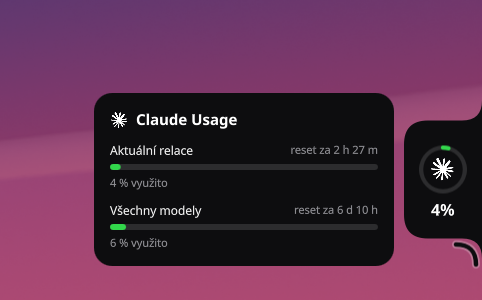
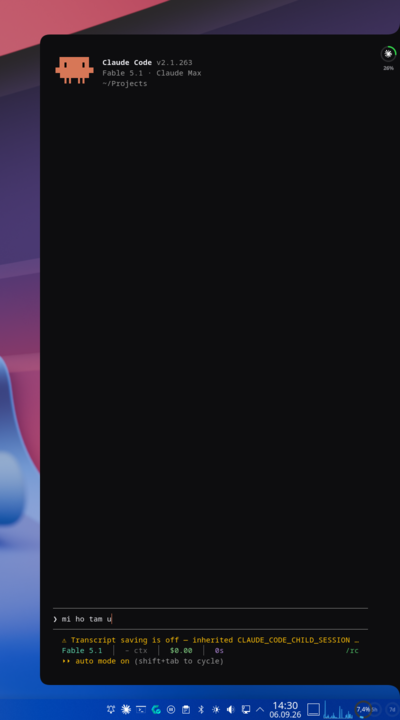
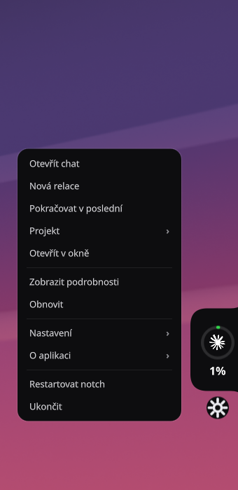

# Claude Notch

**A screen-edge notch for [Claude Code](https://claude.com/claude-code) on KDE Plasma.**
At rest it is a 5-pixel sliver coloured by how much of your plan you have used. Hover and it grows into a bubble with usage rings and reset times. Click and the bubble unfolds into a terminal running your agent — click the strip and it folds back.

<p align="center">
  
</p>
<p align="center">
  
  &nbsp;
  
  &nbsp;
  
</p>

It is one shape the whole time — sliver → bubble → chat — morphing at 60 fps, with inverted corners where it meets the screen edge so it reads as carved into the display rather than parked on top of the wallpaper. Inspired by [Codenotch](https://github.com/vinzdg/codenotch) for macOS; built for Linux from scratch.

## What it shows

| | |
|---|---|
| **Sliver** | green / amber / red by the current 5-hour window; dims when the feed is stale |
| **Bubble** | starburst, usage ring, percentage; a details panel with both limit windows and their reset countdowns |
| **Chat** | your agent in a terminal inside the container, with the ring parked in a side strip |
| **Live activity** | a thin arc spins inside the ring while Claude is working; the ring — and the resting sliver — pulse amber while it waits on you (a permission prompt, a question) |

The numbers come from Claude Code itself. Claude Code hands its status line a JSON blob that already contains `rate_limits.five_hour` and `rate_limits.seven_day` (with `resets_at`); a one-line hook snapshots that to `~/.cache/claude-usage.json`. **No OAuth token is read, no undocumented endpoint is called** — which also means the data refreshes only while a Claude Code session is running. In practice the chat panel *is* a running session.

## Requirements

- KDE Plasma 6 on **Wayland** (tested on 6.7) — the notch is placed through KWin's scripting API
- Python 3.11+ with **PySide6** (QtQml, QtDBus)
- `qdbus6`, `kscreen-doctor`, `jq`
- a terminal — **alacritty** by default; kitty/foot/others via `[terminal].launch`
- Claude Code with a plan that reports rate limits (Pro/Max); any other agent CLI works for the chat panel

On Arch/CachyOS: `sudo pacman -S pyside6 qt6-tools kscreen jq alacritty`

## Install

```sh
git clone https://github.com/Salic99/claude-notch
cd claude-notch
./install.sh --with-statusline --shortcut 'Meta+Ctrl+Shift+A' --start
```

`--with-statusline` installs a ready-made Claude Code status line (model · context · cost · time · plan limits) that includes the feed, backing up any existing one. If you already have a status line you like, skip the flag and add two lines to it instead:

```sh
input=$(cat)
source ~/.local/share/claude-notch/usage-feed.sh
```

Other flags: `--with-plasmoid` (a panel widget with the same rings), `--with-crash-agent` (see *Extras*), `--no-autostart`. The keyboard shortcut becomes active after the next login; the notch itself starts immediately with `--start`.

## Use

| | |
|---|---|
| hover the sliver | usage bubble + details |
| click the sliver / bubble | unfold the chat |
| click the side strip | fold it back |
| `claude-notch toggle` | the same, for shortcuts and scripts |
| hover the orb below the notch, click it | the menu (`claude-notch menu`) |
| `claude-notch start` / `stop` / `restart` / `status` | lifecycle |
| `claude-notch reload` | re-read `config.toml` live (also after hand-editing it) |

The chat is a normal terminal window (`alacritty` with the shipped theme) running `claude` in `~/Projects`, dropping to your shell when the agent exits so the panel never closes under you. It keeps its session while folded — folding hides the window, it does not kill it.

## Live activity

The ring answers *"is it still working?"* Claude Code fires [hooks](https://code.claude.com/docs/en/hooks) at the turns of a session; the installer registers a tiny hook target (`claude-notch-activity`) for five of them:

| Hook | State |
|---|---|
| `UserPromptSubmit`, `PreToolUse` | **busy** — a thin arc spins inside the ring |
| `Notification` | **waiting** — the ring and the resting sliver pulse amber: Claude needs you |
| `Stop`, `SessionEnd` | **idle** |

Each session writes its own record to `~/.cache/claude-notch-activity.json`; the notch shows *waiting* if any session waits, else *busy* if any is busy. A *busy* older than 90 s counts as idle, in case a `Stop` hook never arrived. The hooks are appended to whatever you already have in `~/.claude/settings.json` (backed up first) and take effect for sessions started afterwards.

## The orb menu

Below the notch sits a small arc — the **orb**. Hover it and it becomes a gear; click it (or run `claude-notch menu`) for the menu:

| | |
|---|---|
| **Open / Close chat**, **New session**, **Continue last session** | session control without touching the terminal (`claude --continue` for the last one) |
| **Project ›** | pick the folder the agent starts in — the configured workdir and its most recent sub-folders |
| **Open in a window** | the same agent in a normal, decorated terminal window for longer work |
| **Show details** | keeps the usage bubble open until you click elsewhere |
| **Settings ›** | **Monitor** (lists your outputs), **Panel width**, **Start at login**, **Language**, plus *Edit config file* and *View log* |
| **Restart notch** / **Quit** | |

Settings that change the layout are written to `config.toml` (comments preserved) and applied **live** — monitor, panel width and language take effect without restarting; the chat's terminal keeps its session. After editing `config.toml` by hand, `claude-notch reload` (or the menu) re-reads it.

## Configure

`~/.config/claude-notch/config.toml` — every key is optional; [`config/config.example.toml`](config/config.example.toml) documents them all.

```toml
[agent]
command = "claude"          # or "codex", "opencode", …
workdir = "~/Projects"

[terminal]
launch = "alacritty --config-file {theme} --class {class} -T {title} -e {shell} -c {command}"

[screen]
name = "auto"               # KDE's primary output, or e.g. "DP-2"

[layout]
width = 720                 # chat panel width
```

The UI language follows your desktop locale (English, Czech). `claude-notch restart` after editing.

## How it works — and why it is built this way

**One fixed-size window, morphing content.** Wayland does not let a client position or animate its own window; every move goes through the compositor. So the notch is a single transparent Qt Quick surface the size of the open chat, placed once at the screen edge, and everything visible is drawn inside it: the shape is a canvas path whose width, height, corner radii and *inverted* edge corners are animated properties. The window's **input region** (`QWindow::setMask`) follows the visible shape, so a resting notch only reacts to the sliver and never steals clicks from the desktop.

**Placement via KWin scripting.** `LayerShellQt` would be the textbook way to anchor a surface to a screen edge, but it needs C++ initialisation the `qml` runtime does not perform, and hand-written KWin window rules were silently discarded on reconfigure. What works reliably is KWin's scripting D-Bus API: a tiny JavaScript snippet sets `frameGeometry`, `keepAbove` and `skipTaskbar` by `resourceClass`. KWin caches scripts by *name* and never re-reads the file, so each call registers a fresh name. Calls are serialised on a worker thread so the two D-Bus round trips never stall an animation.

**The terminal lives inside the container.** It is a separate window, inset by a few pixels so the container's rounded corners frame it. On click it is placed immediately but fully transparent; QML watches the unfolding shape and calls back the instant the shape covers the terminal's rectangle, which fades it in — the terminal is never drawn over the wallpaper, and there is no fixed delay to tune. Closing mirrors this: the terminal fades out first, then the shape collapses.

**No flight to the taskbar.** Hiding uses minimize, and KWin animates minimizing windows towards their taskbar icon. The notch fades the window to zero opacity *before* minimizing and un-minimizes it while still transparent, so KWin's animation runs on an invisible window.

**Nothing is drawn without a dark background.** The badge's opacity is a function of how far the shape has grown, and it is hard-gated to its rectangle being inside the shape; the details panel appears only past 60 % of the bubble's growth; the sliver's tint switches to the dark fill the moment the shape leaves sliver size instead of animating through green.

## Plasma widget (optional)

`--with-plasmoid` installs **Claude Usage**, a panel widget with the same 5 h / 7 d rings and reset times. Left click toggles the chat, middle click opens details. Add it to any panel via *Add Widgets*.

## Extras: crash → agent

`--with-crash-agent` installs a small user service that watches `systemd-coredump`. When something crashes you get a notification with **Investigate with the agent**; it collects `coredumpctl info`, the owning package, previous crashes and the surrounding journal into a report and opens your agent on it with a `diagnose-crash` skill that knows how to read a backtrace. Distro-neutral (pacman / dpkg / rpm). The skill is installed into `~/.agents/skills` if that shared hub exists, otherwise `~/.claude/skills`.

## Troubleshooting

- **Everything is grey / "no data".** The feed has not been written yet — start a Claude Code session with the status line hook installed. `cat ~/.cache/claude-usage.json` should show `rate_limits`.
- **The sliver appears on the wrong monitor.** Set `[screen].name` to the output (`kscreen-doctor -o` lists them). "auto" follows KDE's *primary* (priority 1), which is what System Settings shows — Qt's own notion of primary often differs.
- **Clicking does nothing / the terminal never appears.** Check `~/.cache/claude-notch.log` and run `claude-notch restart`. `[terminal].launch` must point at an installed terminal; the agent must be on `PATH`.
- **The shortcut does nothing.** KWin reads shortcut configuration at login — log out and back in.
- **The notch is missing after resuming from sleep or replugging monitors.** `claude-notch reload` re-reads screen geometry.

## Uninstall

```sh
./uninstall.sh           # keeps ~/.config/claude-notch
./uninstall.sh --purge   # removes the config too
```

## Contributing

Issues and pull requests are welcome. The whole app is two files — [`claude-notch/notch.py`](claude-notch/notch.py) (placement, config, D-Bus, terminal) and [`claude-notch/notch.qml`](claude-notch/notch.qml) (the shape and its animations) — so it is a small codebase to read end to end. Things that would be genuinely useful: support for more agents' usage feeds, a left-edge variant, a GNOME port on top of a shell extension.

## License and trademarks

MIT — see [LICENSE](LICENSE).

This is an independent community project. *Claude* and *Claude Code* are trademarks of Anthropic, PBC; this project is not affiliated with or endorsed by Anthropic. The repository ships no Anthropic artwork: the installer extracts the starburst from a Claude app icon *already installed on your machine* (if there is one and ImageMagick is available); otherwise the notch draws a procedural starburst.
